# pratikum5
## Latihan 1
script : latihan1.py

membuat Dictionary daftar kontak

Nama sebagai key, dan nomor sebagai value

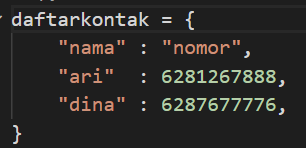

menampilkan kontaknya Ari

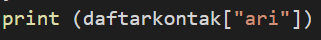

menambah kontak baru dengan nama Riko, nomornya 6287654544

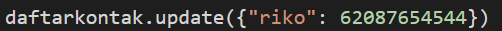

mengubah kontak Dina dengan nomor baru 6288999776

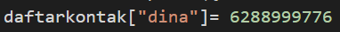

Tampilkan semua Nama

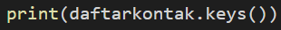

Tampilkan semua Nomor

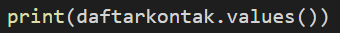

Tampilkan daftar Nama dan nomornya

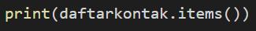

Hapus kontak Dina

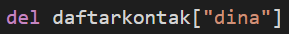

berikut output nya : 

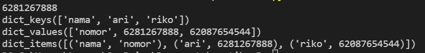

## Pratikum 5
script : pratikum5.py
program sederhana yang akan menampilkan daftar nilai mahasiswa menggunakan Dictionary 

pertama-tama membuat Dictionary kosong, setelah itu buat looping yang aktif yang berisikan menu program, dan buat menu tambah yang berisikan, menginput nama, menginput nim, menginput nilai tugas, menginput nilai uts, menginput nilai uas, menghitung nilai akhir atau jumlah, setelah itu program diatur menambahkan data yang sudah diinputkan ke dictionary. menu ubah, didalam menu ubah berisikan perintah untuk mencari nama yang akan diubah, setelah itu mengambil key dari dictionary dan dapat mengubah nim baru, nilai tugas baru, nilai uts baru, nilai uas baru dan setelah diubah data akan diperbarui di dictionary, jika data tidak ditemukan maka muncul peritah "data tidak ditemukan". menu cari terdapat kolom pencarian yang diperuntukan untuk mencari berdasarkan nama, setelah itu program akan mengambil key dari dictionary jika data yang dimasukan tidak sesuai yang berasa didata program akan muncul peritah " data tidak ditemukan ". menu hapus, memasukan nama yang ingin dihapus setelah itu data akan diambil didictionary dan dihapus sesuai dengan yang dipilih, jika data yang dimasukan tidak sesuai maka muncul perintah "data tidak ditemukan", menu lihat, untuk melihat semua yang telah dikerjakan, jika belum ada yang dikerjaan akan muncul perintah "tidak ada data". menu keluar mengakhiri looping.

script sebagai berikut :

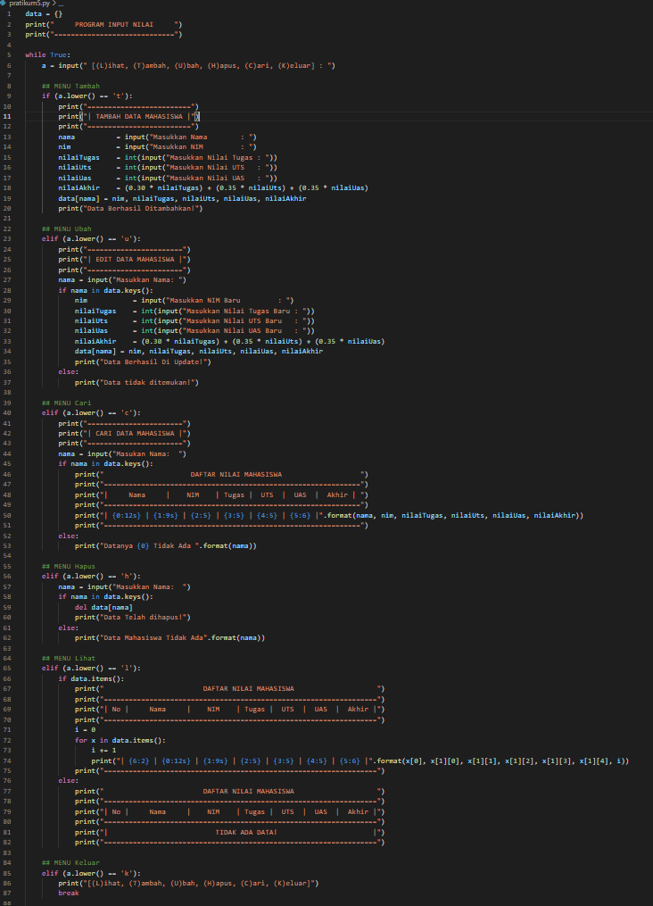

output yang dihasilkan berdasarkan menu : 

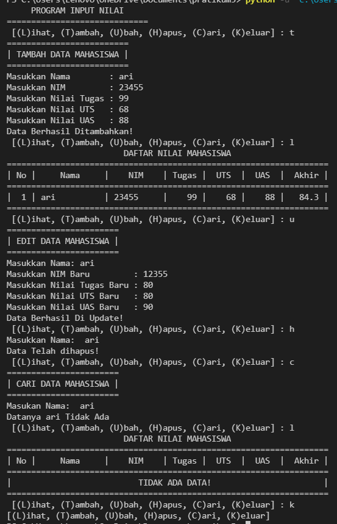

flowchart :

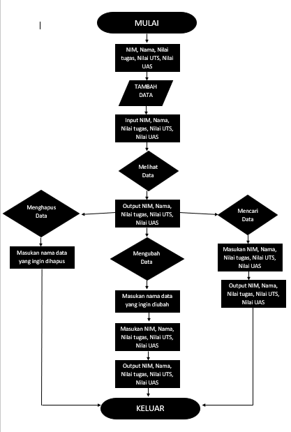

sekian terimakasih

